### Hi there 👋

I'm Florian and in 2021 I graduated the department for informatics at the [HTL St. Pölten](https://www.htlstp.ac.at/abteilungen/informatik) (it's a higher vocational college) with focus on software engeneering with Java, Databases, network engineering and project management. Besides that we learned the basics of cybersecurity and machine learning.
After graduating I started at [Dynatrace](https://www.dynatrace.com/), where I work as a fullstack software engineer.

### Programming
While I was a student I started to learn Python and React and during my internships I worked with Vue.js, Laravel and Openlayers.

With this knowledge and if I find time, I develop small applications.

### Hobbies

In my free time, I spend a lot of time at the volunteer fire brigade and work there as an IT executive since 2021.

I also enjoy playing spikeball and beach volleyball or riding my longboard and mountain bike.

### 📫 Contact 📫

* Email: [schlichting.florian@fasig.at](mailto:schlichting.florian@fasig.at)
* [LinkedIn](https://www.linkedin.com/in/florian-schlichting/)

### Stats

